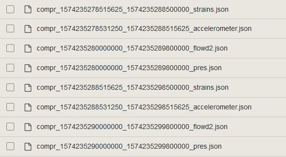
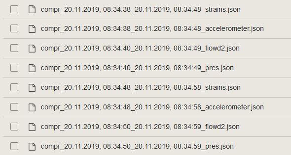

# datetime-substitution
Firefox addon that displays UNIX epoch time strings on any webpage in human readable format.

**This add-on injects JavaScript into web pages. The `addons.mozilla.org` domain disallows this operation, so this add-on will not work properly when it's run on pages in the `addons.mozilla.org` domain.**

## What it does

Replaces text string of UNIX epoch time with a human readable datetime. This runs as a content script and scans web pages, looking for text that can be replaced.

  

## Installation

### Firefox
1. Download latest release (.xpi file) from the "releases" tab. 
2. Open Firefox, open the menu and click extensions (or press ctrl+shift+a).
3. Click the cog-wheel, install extension from file. Select your download.

### Chrome
I haven't released this to the chrome webstore because I don't have 5 dollars. Therefore you have to run it in developer mode.
1. Clone this repository.
2. Open chrome and go to chrome://extensions/ 
3. Enable developer mode (top right button).
4. Load unpackaged (top left). Navigate to source folder in git repo.
